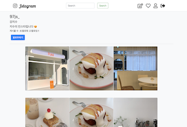

# 인스타그램 스프링 부트로  구현하기프로젝트

사용 툴 : spring boot, thymeleaf, aws s3, spring security ,bootstrap , mysql   
backend위주 (api controller 일부)

구현 기능 : 게시글 작성, 댓글 추가, 회원가입, 로그인, 프로필, 팔로우 

- [controller](./etc/컨트롤러명세.pdf)  
- [src](./src/main/java/com/project/jstagram)  
---

  
  
  

<Jstagram>
 - 2019.10.20
 	- 사진 CRUD 기능
 - 2019.10.22
 	- 댓글 달고 삭제하기 기능 (css X)
	
 - 2019.10.23
 	- index.html, detail.html , header.html 인스타그램 모양으로 부트스트랩 이용해서 꾸밈
 - 2019.11.20
 - 2020.03.21 
	- 핵데이 제출용 추가 구현 예정
