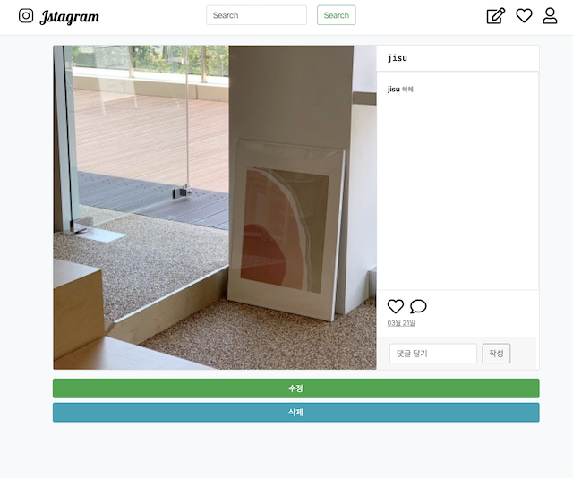

인스타그램 스프링 부트로  구현하기프로젝트

사용 툴 : spring boot, thymeleaf, aws s3, spring security ,bootstrap , mysql 
react.js 랑 api로 back,front 나눈건 없애고 backend로만 다시 구현함

{: width="300" height="250" }
{: width="300" height="250}

<Jstagram>
 - 2019.10.20
 	- 사진 CRUD 기능
 - 2019.10.22
 	- 댓글 달고 삭제하기 기능 (css X
	
 - 2019.10.23
 	- index.html, detail.html , header.html 인스타그램 모양으로 부트스트랩 이용해서 꾸밈
	)
 - 2019.11.20
 - 2020.03.21 
	- 핵데이 제출용 추가 구현 예정
